

    

---

**AudioMan** is an app designed to help students and everyone study or focus at the task at hand. When you first open the App the first thing you see is the current track alongside the track cover, which brings your tracks to life. If you want to download the apk
go to the [releases](https://github.com/Nikolay-Ts/AudioMan/releases/tag/AudioMan).

  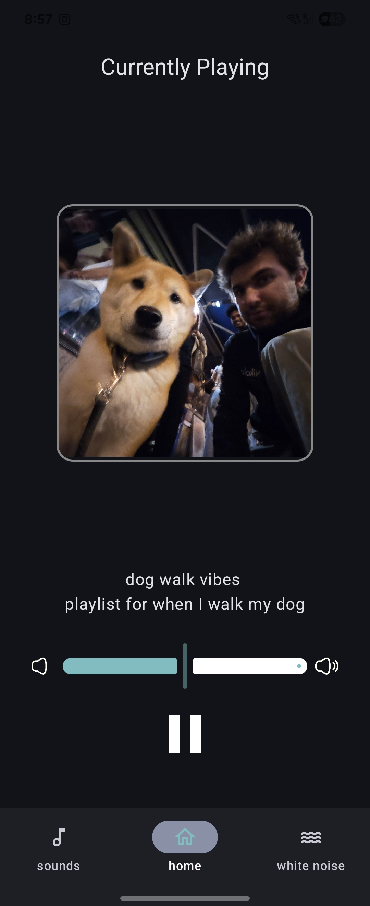
  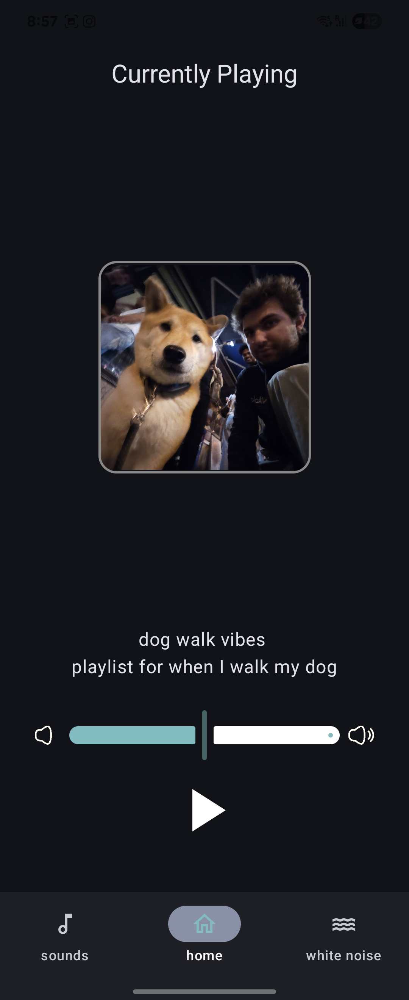

The beauty of covers is that it makes your track, yours and gives you a more unique experience to  display any track cover that you want

## Library 

The Library is where the user can see all of their tracks including the following that come with the app by default.

1. Chilling in a café
2. Rain falling down
3. Stuck in the middle of the forest
4. Chilling by the campfire 
5. Stuck in traffic

AudioMan also allows the user to upload their own `track`, give it a unique name and bring it to life with its own `track cover`. 

  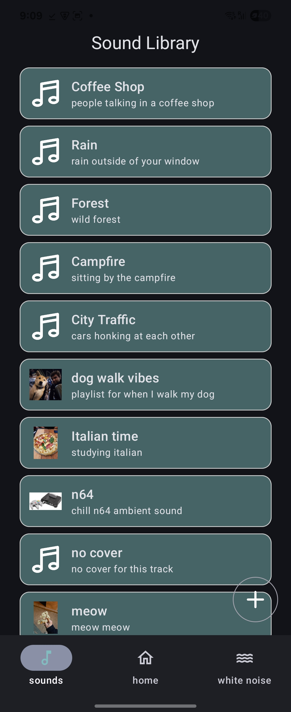

By swiping and long pressing users can edit their track or delete and remove it from the library if they no longer feel the vibe.

  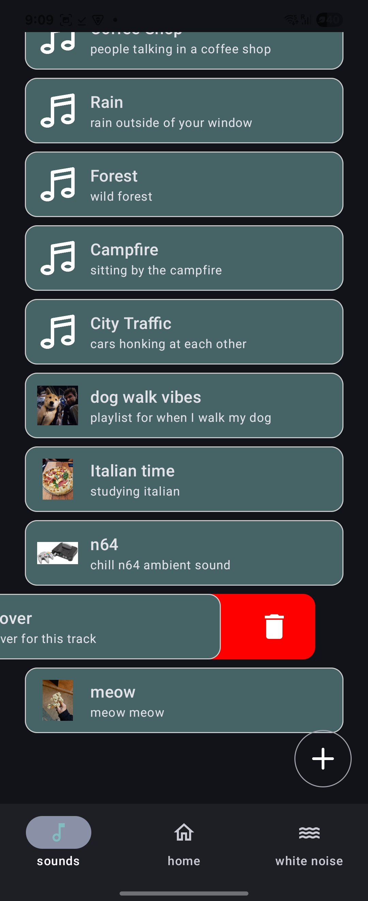
  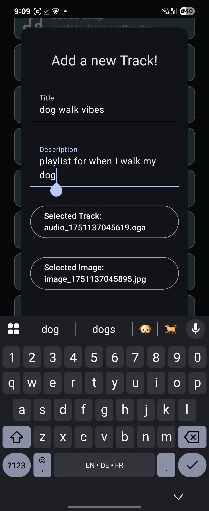

## Custom, Real Time, White Noise

AudioMan also has options for users that prefer tracks that are calmer and more predictable. AudioMan has designed the **white noise** section for those users. 

Users can chose to play either a white, pink or  brown noises. The users can also chose the amplitude and frequency to customize the type of noise the to the user's exact need and mood.

  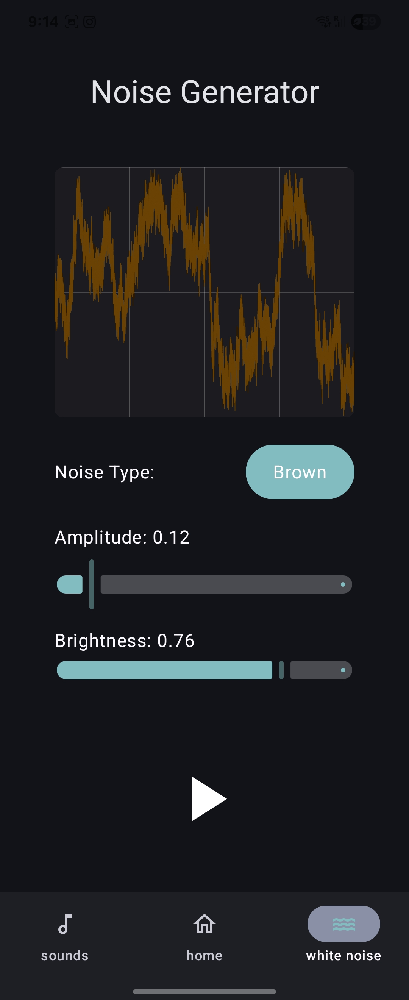
  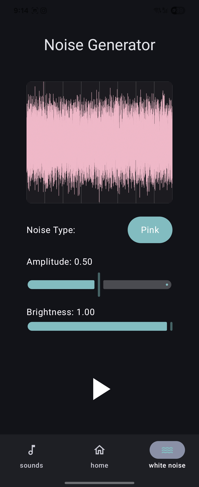

The white noise along side the image are generated in real time to display the actual frequency that the user is currently listening to.

## Sleep Timer 

From the main screen the uer can create a brand new timer. If there is no audio playing a timer
cannot be started. Once started the timer stays in the background and when it hits zero 
the player pauses. This is perfect for those that want to use AudioMan to sleep. 

  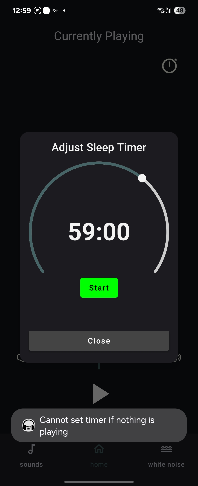
  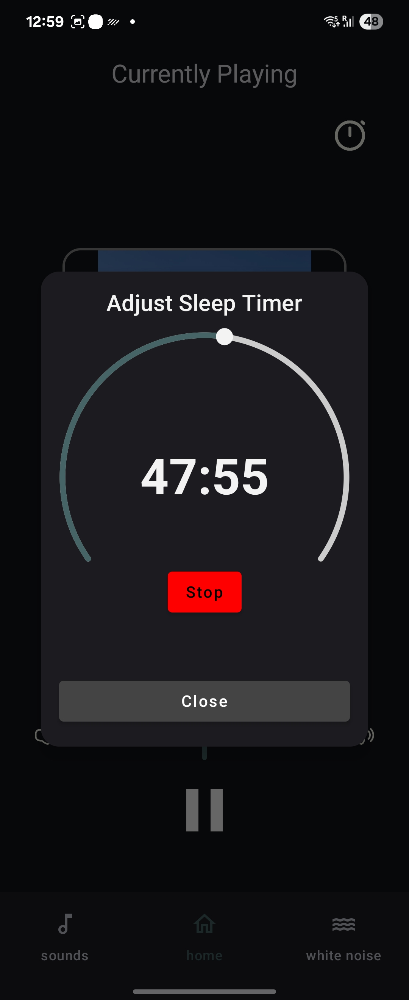

# Widget

A widget can also be added for quick access view and pause/play of the current sound. User
can add a widget just like any other. I made the choice of making the widget as a 4x1
so that the users can create widget stacks with other apps like Spotify or any other podcasting apps. 
This makes it easy as you have all audio widget place in one stack

  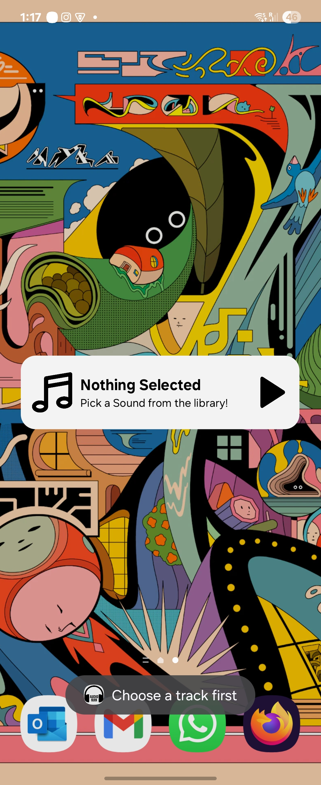
  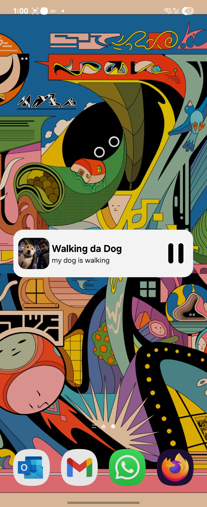

---

## Technical Side

## Sleep timer and persistent thread

For this project the biggest challenge for AudioMan was to synchronize the AudioPlayer.
The AudiPlayer had two main component that were modified and read by almost all views are 
isPlaying and the sound. I needed to use stateFLows to and mutexes to make sure that no 
race conditions would happen. When creating the timer the problem was that when I left
the TimerUI the coroutine that launched `AudioPlayer.Countdown` function would go out of scope
and the function would be removed. Therefore I had to launch it inside the Main thread.

This also meant that the Main thread had to launch the countdown app so it would persist 
for the duration of the app which meant that it had to actively listen to the `isActive`
variable inside the main loop and collect it from the Flow class. 

There were other ways to do this, but they would cause a memory leak so this is the best
way I found to solve this issue. 

## Custom sound optimization

A lot of places I needed to some matrix manipulation i.e. rotating the images to be in the correct
direction or generating the .wav file in the real time. This caused a lot of UI lag as it would
block the UI thread. I could not use the LaunchedEffect thread as it would not be possible so,
instead I chose to use coroutines and would launch these tasks in a background coroutine to 
optimize the rendering and lower the lag to a minimal

## Active rendering

at first I would render the custom tracks using a `foreach`. For the default sounds that is okay
but for the custom ones that created a re-rendering issue as the foreach function does not know
when to re-render things. This was a problem as when I deleted an item it would get removed from
the mutable list but the user would not reopen the library screen to see the changes. 

To fix this I had to refactor the whole page to use a LazyColumn which is perfect as it dynamically
re-renders the components and is perfect for such tasks

## Widget 

For me the widget was the biggest issue, especially with the active refresh of data from the main app.
Originally I wanted to use data stores and use the key preferences as recommended by most but for
me that would not work as the UI would not update. Instead what I chose to do was to use the Flow
and collect it in the widget component. 

This is thanks to the choice of centralized the most important data inside the AudioPlayer object
so that now when there is any change such as playing a new track, it would update the central data
and re-render the widget. 

Another benefit of using this synchronized scheme is the abstraction layer. No matter where you
are in the app, you can asynchronously call `AudioPlayer.pause()` or `AudioPlayer.play()` which
would also dynamically update the ui as internally it modifies the `isPlaying variable`